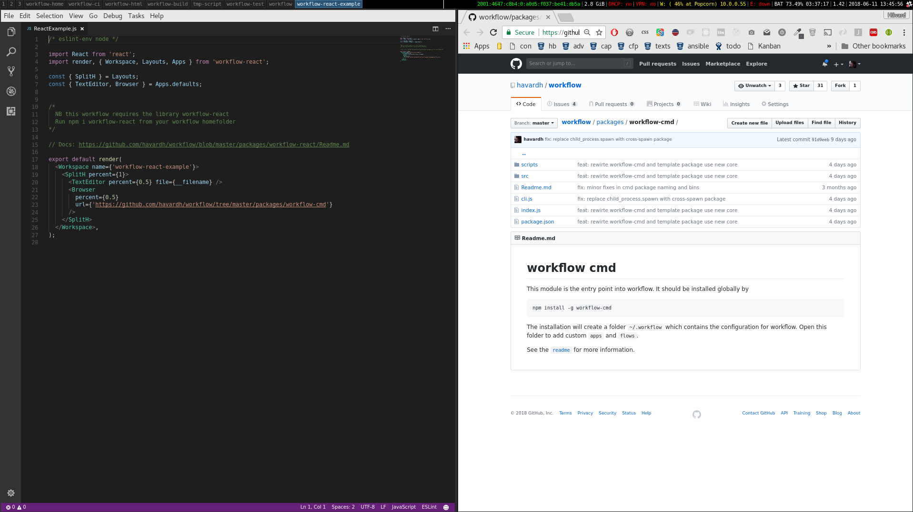

# Workflow

An experiment in declarative windows management with an optional [React](packages/workflow-react)
frontend and an experimental [Angular](packages/workflow-angular) frontend.

## What does it do?

Workflow turns declarative windows layouts defined in javascript files ...

```javascript
export default render(
  <Workspace name={'workflow-react-example'}>
    <SplitH percent={1}>
      <TextEditor percent={0.5} file={__filename} />
      <Browser
        percent={0.5}
        url={'https://github.com/havardh/workflow/tree/master/packages/workflow-cmd'}
      />
    </SplitH>
  </Workspace>,
);
```

... into open applications populated with arguments in the specified layout on the screen.



## Usage

Workflow is a command line tool written for node.

Installing it globally with `npm` will set up the `workflow` command. On the first run, a home directory
will be set up. The default location is at `~/.workflow`. This is overridable with the ``WORKFLOW_HOME`
environment variable. 
```bash
npm install --global workflow
```

Running the command will by default resolve flow files relative to `~/.workflow/flows` or by
an absolute path.
```bash
workflow Example.js # resolves to ~/.workflow/flows/Example.js
workflow /path/to/file.js # resolves the file directly
```

## Cross platform

Workflow is written in a modular way to allow for extension. There are currently experimental support
for [osx](packages/workflow-wm-osx), [windows](packages/workflow-wm-windows), and linux using 
[i3](packages/workflow-wm-i3) or [wmctrl](packages/workflow-wm-wmctrl).

## Devlopment

The [`cli.js`](packages/workflow/src/cli.js) can be executed in development mode. By default
it will use the standard workflow-home directory, which is overridable by `WORKFLOW_DEV_HOME`.
Development mode is activated by setting the environment variable `WORKFLOW_DEV_MODE` to `true`.
Note, you can set up an additional <workflow-home> for dev with the create-workflow-home package.

```bash
yarn // setup all dependencies. 

node ./packages/create-workflow-home/cli.js <workflow-home-dev>
WORKFLOW_DEV_MODE=true WORKFLOW_DEV_HOME=<workflow-home-dev> node ./packages/workflow/cli.js Example.js
```

## Contributions

All contributions to `workflow` are welcome. Checkout the [Contributions](contributions.md) guide to get started.

## Code of conduct

By making a contribution to this project you agree to abide by the 
[Code of Conduct](code-of-conduct.md).
