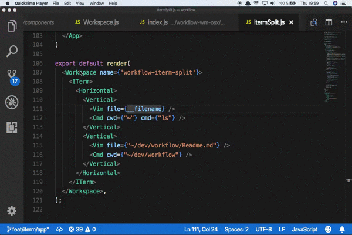

# iTerm app for workflow

Workflow iTerm app for workflow with layout management within the iTerm2
instance.

The `SplitV` and `SplitH` layouts from the `workflow-layout-tiled` module can be used
to create arbitrary tile layouts. They can contain a number of Apps or nested
layout components. The width of each split is not possible to specify, it will
be the size of the contained area divide by the number of children. 

## Example

```
import React from 'react';
import render, { Workspace, requireComponent } from 'workflow-react';

import ITerm from "workflow-app-iterm";

const { SplitV, SplitH } = requireComponent("workflow-layout-tiled");
const Vim = requireComponent("workflow-app-vim");
const Terminal = requireComponent("workflow-app-terminal");
const Emacs = requireComponent("workflow-app-emacs");;

export default render(
  <Workspace name={'workflow-iterm-split'}>
    <ITerm>
      <SplitH>
        <SplitV>
          <Vim file={__filename} />
          <Terminal cwd={"~"} cmd={"ls"} />
        </SplitV>
        <SplitV>
          <Emacs file={"~/dev/workflow/Readme.md"} />
          <Terminal cwd={"~"} cmd={"ls"} />
        </SplitV>
      </SplitH>
    </ITerm>
  </Workspace>,
);
```

## Demo

Try it with: `yarn ItermSplit`


