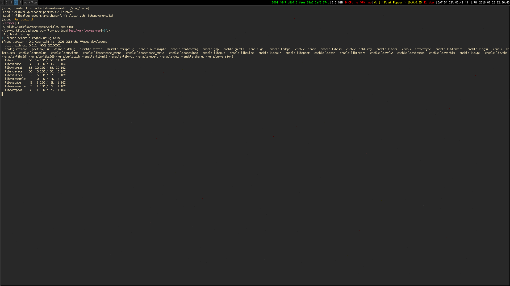

# tmux app for workflow

Workflow tmux app for workflow with layout management within the tmux
instance.

The `SplitV` and `SplitH` components exported by `workflow-react` can be used
to create arbitrary tile layouts. They can contain a number of Apps or nested
layout components. The apps are `Emacs`, `Vim`, `Less`, and `Terminal` found in
the `workflow-apps-terminal` package.
Look at the [apps](../workflow-apps-terminal/src/apps.js) file to see how to 
define new ones.
Checkout the [flow/](flow) folder for examples.

## How to use

For now, the tmux app works only when running workflow to configure a single
terminal instance. This can be done by using the `workflow-wm-terminal` package. A minimal `config.js` example for how to use this is included below.


```js
const {join} = require("path");
const WorkflowResolverRelative = require("workflow-resolver-relative");
const WorkflowResolverAbsolute = require("workflow-resolver-absolute");
const WorkflowLoaderBabel = require("workflow-loader-babel");
const WorkflowParserArguments = require("workflow-parser-arguments");
const WorkflowTransformerApplyArgumentsToFields = require("workflow-transformer-apply-arguments-to-fields");
const WorkflowLayout = require("workflow-layout");
const WorkflowWmTerminal = require("workflow-wm-terminal");

const config = {
  presets: [
    "flow",
    "react",
    ["env", {
      "targets": {
        "node": "current"
      }
    }]
  ],
  plugins: ["transform-object-rest-spread", "transform-class-properties"]
};

module.exports = {
  resolvers: [
    new WorkflowResolverAbsolute(),
    new WorkflowResolverRelative({path: process.cwd()}),
    new WorkflowResolverRelative({path: join(__dirname, "flows")})
  ],
  loader: new WorkflowLoaderBabel({config}),
  argumentParser: new WorkflowParserArguments(),
  transformers: [new WorkflowTransformerApplyArgumentsToFields()],
  layout: new WorkflowLayout(),
  wm: new WorkflowWmTerminal()
};

```

The `workflow` command will echo a command which must be used to attach to 
the tmux instance. So to use `workflow` with this module the following two 
commands must be executed.

```bash
workflow <> # echo'es the line '  Attach with: tmux attach-session -t <session-name>'
tmux attach-session -t <session-name>
```

The `session-name` is the `sessionName` parameter provided to the `Tmux` node 
in the `flow` file. 

```js
// ...

export default render(
  <Workspace>
    <Tmux sessionName={"session-name"}>...</Tmux>
  </Workspace>
);


```


## Demo

Note you will need to run `rollup -c` from the root before executing the example.

Try it with: `yarn TmuxExample`


